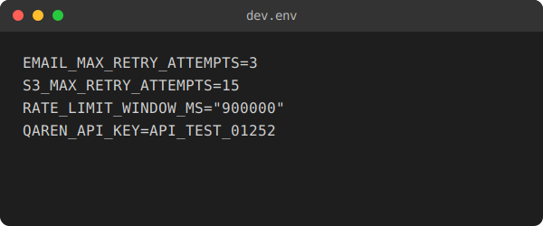
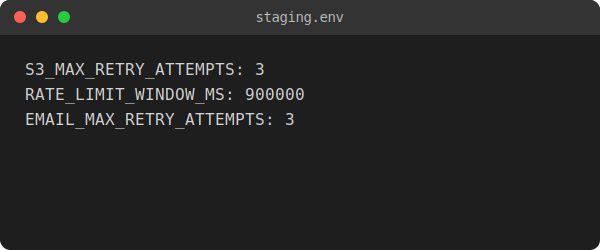

<p align="center">
  
</p>

<h1 align="center">Qaren (قارن)</h1>

<p align="center">
  <a href="../README.md">English</a> | 
  <a href="README.zh.md">中文</a> | 
  <a href="README.ru.md">Русский</a> | 
  <a href="README.ar.md">العربية</a> | 
  <a href="README.fa.md">فارسی</a> | 
  <a href="README.ja.md">日本語</a> | 
  <a href="README.de.md">Deutsch</a> | 
  <a href="README.fr.md">Français</a>
</p>

<p align="center">
  <b>الجيل القادم من أدوات مقارنة الإعدادات (Configurations) والنسخ الاحتياطي للنظام (System Backups).</b><br>
  صُمم لعصر الـ DevOps الحديث: دلالي، آمن، وسريع للغاية.
</p>

<p align="center">
  
  
  
  
  <a href="https://github.com/qaren-cli/qaren/actions/workflows/release.yml">
    
  </a>
</p>

---

## لماذا قارن؟ [](https://qaren.me) &nbsp; [](https://www.linkedin.com/in/alielesawy) &nbsp; [](https://github.com/alielesawy)

أداة `diff` القياسية خدمت المهندسين لـ 50 عاماً، لكنها صُممت للشفرة المصدرية (Source Code)، وليس لملفات الإعدادات المعقدة والنسخ الاحتياطي الضخم للنظام الذي لا يعتمد على ترتيب الأسطر كما هو الحال اليوم.

**قارن (Qaren)** هي أداة متعددة الأنماط تفهم بياناتك.

- **تحليل دلالي (Key-Value)**: الترتيب لا يهم. التنسيق لا يهم. البيانات فقط هي ما يهم.
- **أمان مطلق (Zero-Trust)**: يتم إخفاء الأسرار مثل مفاتيح الـ API وكلمات المرور تلقائياً (`***MASKED***`).
- **سرعة فائقة**: مُحسَّن بلغة Rust للتعامل مع نسخ احتياطي بحجم جيجابايت وأكثر من 100 ألف مفتاح بسرعة تصل إلى **200 ضعف** أسرع من أدوات diff التقليدية.
- **دعم ANSI**: يقوم بتنظيف أكواد الألوان الخاصة بالطرفية تلقائياً من الملفات "الملوثة" (مثل مخرجات `pm2 env`) لمقارنة نظيفة.
- **رقع ذكية (Patching)**: إنشاء ملفات تزامن `.env` جاهزة للإنتاج لمطابقة البيئات في ثوانٍ.

---

##  التوثيق
للاطلاع على الأدلة التفصيلية، ومرجع الـ API، والإعدادات المتقدمة، تفضل بزيارة موقع التوثيق الخاص بنا:
> **[https://qaren.me/docs](https://qaren.me/docs)**

---

##  الميزات الرئيسية

### 1. نمط KV الدلالي
يفهم ملفات `.env` و `.yaml` و `.ini` بغض النظر عن ترتيب المفاتيح.
<p align="center">
  
</p>

### 2. مخرجات نصية محسنة
يوفر "قارن" مقارنة أسطر أوضح بكثير من POSIX diff، مصممة خصيصاً لتحليل ملفات النسخ الاحتياطي للنظام.

<p align="center">
  <b>أداة Diff التقليدية (POSIX)</b><br>
  
</p>

<p align="center">
  <b>مقارنة قارن المحسنة (Qaren)</b><br>
  
</p>

### 3. تقليل الضجيج الذكي
يقوم "قارن" تلقائياً بإخفاء تحذيرات المفاتيح المتكررة وتنبيهات الأذونات بشكل افتراضي للحفاظ على نظافة الطرفية. إذا كنت بحاجة للمساعدة في استكشاف الأخطاء وإصلاحها، قم بتشغيل `qaren config advisor toggle` لتمكين التنبيهات المفيدة.

---

##  التثبيت

### التثبيت السريع (آلي)

| المنصة | الأمر |
| :--- | :--- |
| **Linux / macOS** | `curl -sSfL https://qaren.me/install | sh` |
| **Windows** | `irm https://qaren.me/install.ps1 | iex` |
| **Homebrew** | `brew tap qaren-cli/qaren && brew install qaren` |

### طرق بديلة
```bash
# عبر Cargo
cargo install qaren
```

---

##  الاستخدام وأمثلة

صُمم نمط `kv` في "قارن" لمهام DevOps الواقعية. تم اختبار جميع الأمثلة التالية باستخدام البيانات الموضحة في ملفي البيئة هذين:

<p align="center">
  
  
</p>

### 1. مقارنة دلالية أساسية
مقارنة ملفين دلالياً مع تجاهل ترتيب الأسطر.
```bash
qaren kv -Q --d2 ":" dev.env staging.env
```
<p align="center">
  
</p>

### 2. نمط الملخص
احصل على نظرة عامة عالية المستوى على الاختلافات دون تغييرات تفصيلية في الأسطر.
```bash
qaren kv -Q --d2 ":" dev.env staging.env -s
```
<p align="center">
  
</p>

### 3. تصدير JSON
تصدير النتائج بتنسيق قابل للقراءة آلياً للأتمتة.
```bash
qaren kv -Q --d2 ":" dev.env staging.env -o json
```
<p align="center">
  
</p>

### 4. إظهار الأسرار
تجاوز الإخفاء التلقائي لرؤية القيم الحساسة الخام.
```bash
qaren kv -Q --d2 ":" dev.env staging.env -S
```
<p align="center">
  
</p>

### 5. تجاهل مفاتيح معينة
استبعاد المفاتيح الديناميكية المعروفة أو غير ذات الصلة من المقارنة.
```bash
qaren kv -Q --d2 ":" dev.env staging.env -x API_KEY
```
<p align="center">
  
</p>

### 6. تجاهل بواسطة الكلمة المفتاحية
استبعاد جميع المفاتيح التي تحتوي على سلسلة فرعية محددة.
```bash
qaren kv --ignore-keyword MAX ...
```
<p align="center">
  
</p>

### 7. النمط الهادئ
التحقق من التوافق في البرامج النصية عبر أكواد الخروج فقط.
```bash
qaren kv -Q --d2 ":" dev.env staging.env -q
```
<p align="center">
  
</p>

### 8. إنشاء رقعة (Patch)
إنشاء ملف رقعة لمزامنة المفاتيح المفقودة.
```bash
qaren kv ... -g missing.env
```
<p align="center">
  
</p>

### 9. رقع آمنة
إنشاء رقع مع إخفاء البيانات الحساسة تلقائياً.
```bash
qaren kv ... -g missing.env --mask-patches
```
<p align="center">
  
</p>

---

##  المقارنة الحرفية (Diff)
```bash
# تنسيق unified diff (متوافق مع POSIX)
qaren diff file1.txt file2.txt -u

# مقارنة المجلدات بشكل متكرر
qaren diff -r ./backup-old ./backup-new

# مسح ألوان ANSI من ملفات النسخ الاحتياطي قبل المقارنة
qaren diff backup_polluted.txt backup_clean.txt -A

# تجاهل المسافات والأسطر الفارغة
qaren diff f1.txt f2.txt -w -B
```

---

##  الإعدادات

يتذكر "قارن" تفضيلاتك.
<p align="center">
  
</p>

```bash
# تبديل نمط خطوط الأنابيب (الخروج دائماً بـ 0)
qaren config exit toggle

# تبديل مخرجات الألوان
qaren config color toggle

# تبديل المستشار (التحذيرات)
qaren config advisor toggle

# تبديل إخفاء الأسرار
qaren config masking toggle

# عرض الإعدادات الحالية
qaren config show
```

---

##  اختبارات الأداء
| السيناريو | الفائز | الفرق |
| :--- | :--- | :--- |
| **نسخ احتياطي ضخم (100MB)** | **قارن (Qaren)** | **200x+** |
| **المجلدات المتكررة** | **قارن (Qaren)** | **3x** |
| **تغييرات هائلة (مليون سطر)** | **قارن (Qaren)** | **50x+** |

---

##  المساهمة والدعم

نحن **نرحب بالمساهمات!** يرجى قراءة **[دليل المساهمة](CONTRIBUTING.md)** قبل تقديم طلب سحب (Pull Request).

- [ ] **Fork** للمستودع.
- [ ] **تحسين** أو **إضافة** ميزات (تجنب الحذف).
- [ ] التأكد من **عدم وجود تحذيرات** (`clippy` و `tests`).
- [ ] تحديث **التوثيق** و **--help** للأعلام (flags) الجديدة.

 **يرجى إعطاء نجمة للمشروع إذا وجدته مفيداً!**

- **الموقع الرسمي**: [https://qaren.me/](https://qaren.me/)
- **التوثيق الكامل**: [https://qaren.me/docs](https://qaren.me/docs)
- **تقارير الأخطاء**: انتقل إلى [https://qaren.me/community](https://qaren.me/community) واضغط على **"Open Issue"**.

---

##  الترخيص
هذا المشروع مرخص بموجب **رخصة MIT**. راجع ملف `LICENSE` لمزيد من التفاصيل.

---

<p align="right">(قارن) — صنع بكل فخر للمهندسين</p>
