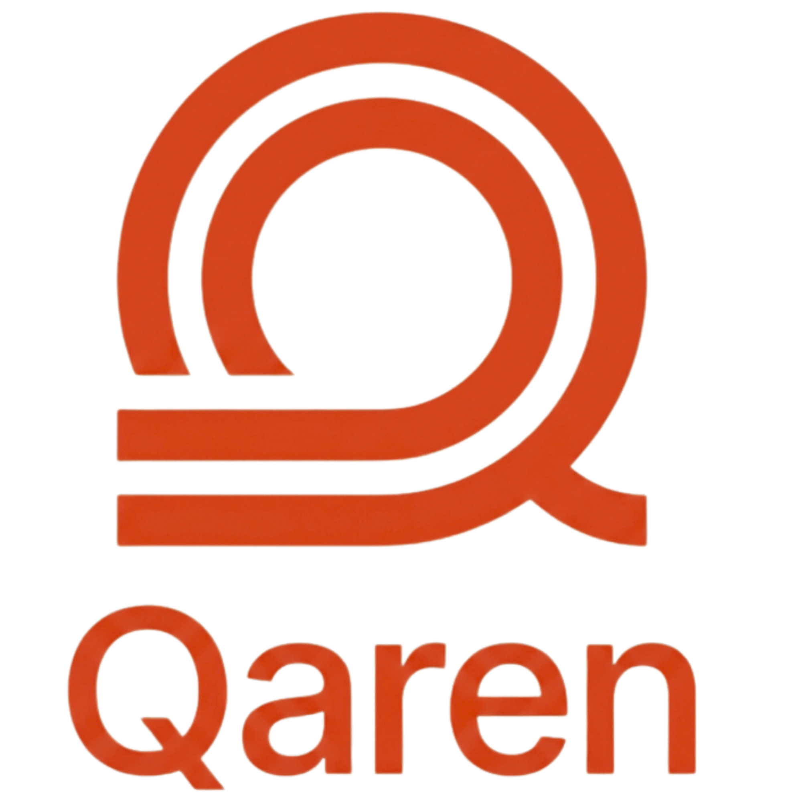

<p align="center">
  
</p>

<h1 align="center">Qaren (قارن)</h1>

<p align="center">
  <a href="../README.md">English</a> | 
  <a href="README.zh.md">中文</a> | 
  <a href="README.ru.md">Русский</a> | 
  <a href="README.ar.md">العربية</a> | 
  <a href="README.fa.md">فارسی</a> | 
  <a href="README.ja.md">日本語</a> | 
  <a href="README.de.md">Deutsch</a> | 
  <a href="README.fr.md">Français</a>
</p>

<p align="center">
  <b>Die nächste Generation des Konfigurations- und System-Backup-Vergleichs.</b><br>
  Entwickelt für die moderne DevOps-Ära: Semantisch, Sicher und Blitzschnell.
</p>

<p align="center">
  
  
  
  
  <a href="https://github.com/qaren-cli/qaren/actions/workflows/release.yml">
    
  </a>
</p>

---

## Warum Qaren?  &nbsp; [](https://www.linkedin.com/in/alielesawy) &nbsp; [](https://github.com/alielesawy)

Das standardmäßige POSIX `diff` dient uns seit 50 Jahren, wurde jedoch für Quellcode entwickelt – nicht für die komplexen, reihenfolgeunabhängigen Konfigurationsdateien und massiven System-Backups von heute.

Qaren (arabisch für **„Vergleichen“**) ist ein Multi-Paradigma-Tool, das Ihre Daten versteht.

- **Semantisches Key-Value-Parsing**: Die Reihenfolge spielt keine Rolle. Die Formatierung spielt keine Rolle. Nur die Daten zählen.
- **Zero-Trust-Sicherheit**: Geheimnisse wie API-Schlüssel, Passwörter und Verbindungszeichenfolgen werden standardmäßig maskiert (`***MASKED***`).
- **Blitzschnell**: In Rust optimiert, um System-Backups im GB-Bereich und über 100k Schlüssel bis zu **200-mal schneller** zu verarbeiten als herkömmliche Diff-Pipelines.
- **ANSI-Unterstützung**: Bereinigt Terminal-Farbcodes automatisch aus „verunreinigten“ Dateien (wie `pm2 env`-Ausgaben) für einen sauberen Vergleich.
- **Intelligentes Patching**: Erstellen Sie produktionsbereite `.env`-Patches, um Umgebungen in Sekundenschnelle zu synchronisieren.

---

##  Dokumentation
Detaillierte Anleitungen, API-Referenzen und erweiterte Konfigurationen finden Sie in unserer Dokumentation:
> **[https://qaren.me/docs](https://qaren.me/docs)**

---

##  Hauptmerkmale

### 1. Semantischer KV-Modus
Versteht `.env`-, `.yaml`- und `.ini`-Dateien unabhängig von der Schlüsselreihenfolge.
<p align="center">
  
</p>

### 2. Verbesserte Textausgabe
Qaren bietet viel klarere zeilenweise Diffs als POSIX-Diff, speziell optimiert für die Analyse von System-Backups.
```bash
$ qaren diff backup-old backup-new -w
-[L47] TimeoutOverflowWarning: does not fit into a 32-bit integer.
+[L47] TimeoutOverflowWarning: 3000010000 does not fit into a 32-bit integer.
```

### 3. Intelligente Rauschunterdrückung
Vergleichen Sie JSON-Backups im KV-Modus? Qaren unterdrückt standardmäßig Warnungen zu doppelten Schlüsseln und Berechtigungen, um Ihr Terminal sauber zu halten. Wenn Sie Hilfe bei der Fehlersuche benötigen, führen Sie `qaren config advisor toggle` aus, um hilfreiche Warnmeldungen zu aktivieren.

---

##  Installation

### Schnellinstallation (Automatisiert)

| Plattform | Befehl |
| :--- | :--- |
| **Linux / macOS** | `curl -sSfL https://qaren.me/install | sh` |
| **Windows** | `irm https://qaren.me/install.ps1 | iex` |
| **Homebrew** | `brew tap qaren-cli/qaren && brew install qaren` |

### Alternative Methoden
```bash
# Über Cargo
cargo install qaren
```

---

##  Nutzung & Beispiele

Der `kv`-Modus von Qaren ist für reale DevOps-Aufgaben konzipiert. Hier sind gängige Muster zum Vergleich von Umgebungsdateien.

### 1. Basis Semantik-Diff
Vergleichen Sie zwei Dateien semantisch, wobei die Zeilenreihenfolge ignoriert wird.
```bash
qaren kv -Q --d2 ":" dev.env staging.env
```
<p align="center">
  
</p>

### 2. Zusammenfassungsmodus
Erhalten Sie einen allgemeinen Überblick über die Unterschiede ohne detaillierte Zeilenänderungen.
```bash
qaren kv -Q --d2 ":" dev.env staging.env -s
```
<p align="center">
  
</p>

### 3. JSON Export
Exportieren Sie die Ergebnisse in einem maschinenlesbaren Format für die Automatisierung.
```bash
qaren kv -Q --d2 ":" dev.env staging.env -o json
```
<p align="center">
  
</p>

### 4. Geheimnisse zeigen
Umgehen Sie die automatische Maskierung, um rohe sensible Werte zu sehen.
```bash
qaren kv -Q --d2 ":" dev.env staging.env -S
```
<p align="center">
  
</p>

### 5. Schlüssel ignorieren
Schließen Sie bekannte dynamische oder irrelevante Schlüssel vom Vergleich aus.
```bash
qaren kv -Q --d2 ":" dev.env staging.env -x API_KEY
```
<p align="center">
  
</p>

### 6. Ignorieren nach Schlüsselwort
Schließen Sie alle Schlüssel aus, die eine bestimmte Teilzeichenfolge enthalten.
```bash
qaren kv --ignore-keyword MAX ...
```
<p align="center">
  
</p>

### 7. Stiller Modus
Prüfen Sie die Kompatibilität in Skripten nur über Exit-Codes.
```bash
qaren kv -Q --d2 ":" dev.env staging.env -q
```
<p align="center">
  
</p>

### 8. Patch-Generierung
Erstellen Sie eine Patch-Datei, um fehlende Schlüssel zu synchronisieren.
```bash
qaren kv ... -g missing.env
```
<p align="center">
  
</p>

### 9. Sichere Patches
Generieren Sie Patches, bei denen sensible Daten automatisch maskiert werden.
```bash
qaren kv ... -g missing.env --mask-patches
```
<p align="center">
  
</p>

---

##  Wörtlicher Vergleich (Diff)
```bash
# Unified-Diff-Format (POSIX-konform)
qaren diff file1.txt file2.txt -u

# Rekursiver Verzeichnis-Diff
qaren diff -r ./backup-old ./backup-new

# ANSI-Farben vor dem Diff aus Backup-Dateien entfernen
qaren diff backup_polluted.txt backup_clean.txt -A

# Leerzeichen und Leerzeilen ignorieren
qaren diff f1.txt f2.txt -w -B
```

---

##  Konfiguration

Qaren merkt sich Ihre Einstellungen.
<p align="center">
  
</p>

```bash
# Pipeline-freundlichen Modus umschalten (beendet immer mit 0)
qaren config exit toggle

# Farbausgabe umschalten
qaren config color toggle

# Advisor (Warnungen) umschalten
qaren config advisor toggle

# Geheimnis-Maskierung umschalten
qaren config masking toggle

# Aktuelle Einstellungen anzeigen
qaren config show
```

---

##  Performance-Benchmarks
| Szenario | Gewinner | Vorsprung |
| :--- | :--- | :--- |
| **Große Backups (100MB)** | **Qaren** | **200x+** |
| **Rekursives Verzeichnis** | **Qaren** | **3x** |
| **Massive Änderungen (1M Zeilen)** | **Qaren** | **50x+** |

---

##  Mitwirken & Support

Wir sind **offen für Beiträge!** Bitte lesen Sie unseren **[Contributing Guide](CONTRIBUTING.md)**, bevor Sie einen Pull Request einreichen.

- [ ] **Forken** Sie das Repo.
- [ ] **Verbessern** Sie Features oder **fügen** Sie neue hinzu (Vermeiden Sie Löschungen).
- [ ] Stellen Sie **Null Warnungen** sicher (`clippy` & `tests`).
- [ ] Aktualisieren Sie die **Docs** und **--help** für neue Flags.

 **Bitte geben Sie dem Projekt einen Stern, wenn Sie es nützlich finden!**

- **Offizielle Webseite**: [https://qaren.me/](https://qaren.me/)
- **Vollständige Dokumentation**: [https://qaren.me/docs](https://qaren.me/docs)
- **Fehlerberichte**: Gehen Sie zu [https://qaren.me/community](https://qaren.me/community) und klicken Sie auf **„Open Issue“**.

---

##  Lizenz
Dieses Projekt steht unter der **MIT-Lizenz**. Weitere Details finden Sie in der Datei `LICENSE`.

---

<p align="right">(قارن) — Mit Stolz für Ingenieure entwickelt</p>
